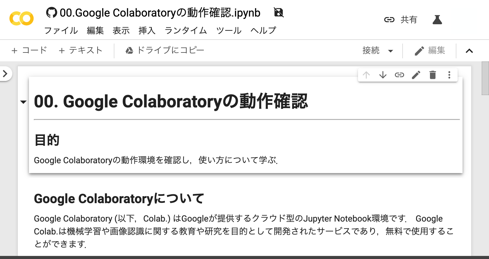

# Google Colab Notebooks

このリポジトリはコンピュータビジョン・（深層）機械学習を学ぶためのプログラムが含まれています．
プログラムは全てJupyter Notebookで記述されており，Google Colabを用いて実行することを想定しています．
（※使用者自身の保有する計算機サーバ上でJupyter Notebook / Jupyter Lab等を起動して使用することも可能です．）

## Google Colabで開くためのリンク

以下は，ノートブックをGoogle Colabで開くためのリンクです．
使用するノートブックのリンクをクリックすると，Google Colabでノートブックが開くので，各自のGoogleドライブへコピーして使用してください．

[00.Google Colaboratoryの動作確認](https://colab.research.google.com/github/machine-perception-robotics-group/GoogleColabNotebooks/blob/master/notebooks/00_operation_check_of_google_colab.ipynb)

[01.グラフを描画する](https://colab.research.google.com/github/machine-perception-robotics-group/GoogleColabNotebooks/blob/master/notebooks/01_drawing_graph.ipynb)

[02.ユークリッド距離を用いたクラス識別](https://colab.research.google.com/github/machine-perception-robotics-group/GoogleColabNotebooks/blob/master/notebooks/02_classification_by_euclidean_distance.ipynb)

[03.マハラノビス距離を用いたクラス識別](https://colab.research.google.com/github/machine-perception-robotics-group/GoogleColabNotebooks/blob/master/notebooks/03_classification_by_mahalanobis_distance.ipynb)

[04.k最近傍法による教師あり学習](https://colab.research.google.com/github/machine-perception-robotics-group/GoogleColabNotebooks/blob/master/notebooks/04_supervised_learning_by_k-nearest_neighbor.ipynb)

[05.線形SVMによる教師あり学習](https://colab.research.google.com/github/machine-perception-robotics-group/GoogleColabNotebooks/blob/master/notebooks/05_supervised_learning_by_linear_svm.ipynb)

[06.非線形SVMによる教師あり学習](https://colab.research.google.com/github/machine-perception-robotics-group/GoogleColabNotebooks/blob/master/notebooks/06_supervised_learning_by_nonliear_svm.ipynb)

[07.AdaBoostによる教師あり学習](https://colab.research.google.com/github/machine-perception-robotics-group/GoogleColabNotebooks/blob/master/notebooks/07_supervised_learning_by_adaboost.ipynb)

[08.RandomForestによる教師あり学習](https://colab.research.google.com/github/machine-perception-robotics-group/GoogleColabNotebooks/blob/master/notebooks/08_supervised_learning_by_random_forest.ipynb)

[09.MNISTを用いた文字認識(MLP)](https://colab.research.google.com/github/machine-perception-robotics-group/GoogleColabNotebooks/blob/master/notebooks/09_MNIST_MLP.ipynb)

[10.MNISTを用いた文字認識(CNN)](https://colab.research.google.com/github/machine-perception-robotics-group/GoogleColabNotebooks/blob/master/notebooks/10_MNIST_CNN.ipynb)

[11.CIFAR10を用いた物体認識](https://colab.research.google.com/github/machine-perception-robotics-group/GoogleColabNotebooks/blob/master/notebooks/11_CIFAR_CNN.ipynb)

[12.CIFAR10を用いた物体認識（Data Augmentation）](https://colab.research.google.com/github/machine-perception-robotics-group/GoogleColabNotebooks/blob/master/notebooks/12_augmentation.ipynb)

[13.CIFAR10を用いた物体認識（ResNet）](https://colab.research.google.com/github/machine-perception-robotics-group/GoogleColabNotebooks/blob/master/notebooks/13_cifar_resnet.ipynb)

[14.Recurrent Neural Networkによる電力予測](https://colab.research.google.com/github/machine-perception-robotics-group/GoogleColabNotebooks/blob/master/notebooks/14_power_prediction_by_recurrent_neural_network.ipynb)

[15.Auto Encoderによる画像の復元とデノイジング](https://colab.research.google.com/github/machine-perception-robotics-group/GoogleColabNotebooks/blob/master/notebooks/15_image_reconstruction_denoising_by_autoencoder.ipynb)

[16.強化学習によるCart Pole制御](https://colab.research.google.com/github/machine-perception-robotics-group/GoogleColabNotebooks/blob/master/notebooks/16_cart_pole_control_by_deep_reinforcement_learning.ipynb)

## Google Colabを用いたノートブックの実行方法

このリポジトリのノートブックをGoogle Colabで実行するためには，実行したいノートブックのURLのうち，`github.com`を`colab.research.google.com/github`に置き換えてアクセスすることで，直接Google Colabで開くことが可能です．
その後，画面上部の「ドライブにコピー」をクリックすることで，自身のGoogle Driveへノートブックがコピーされます．
コピーされたノートブックを開き，実行してください．

